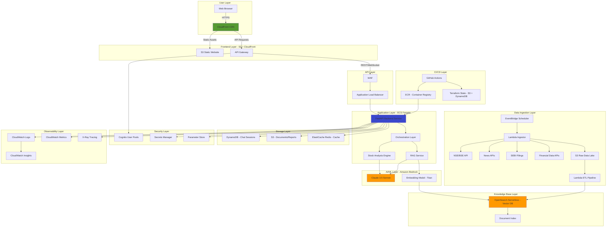
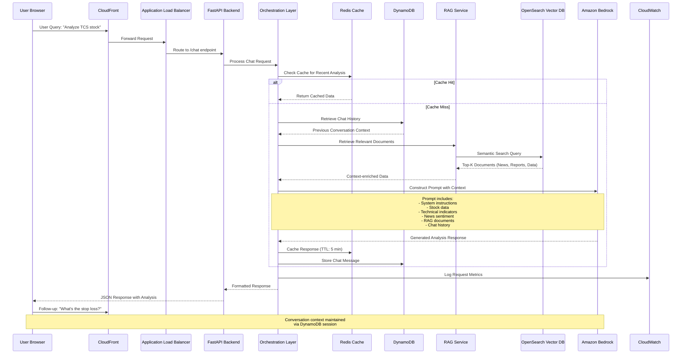
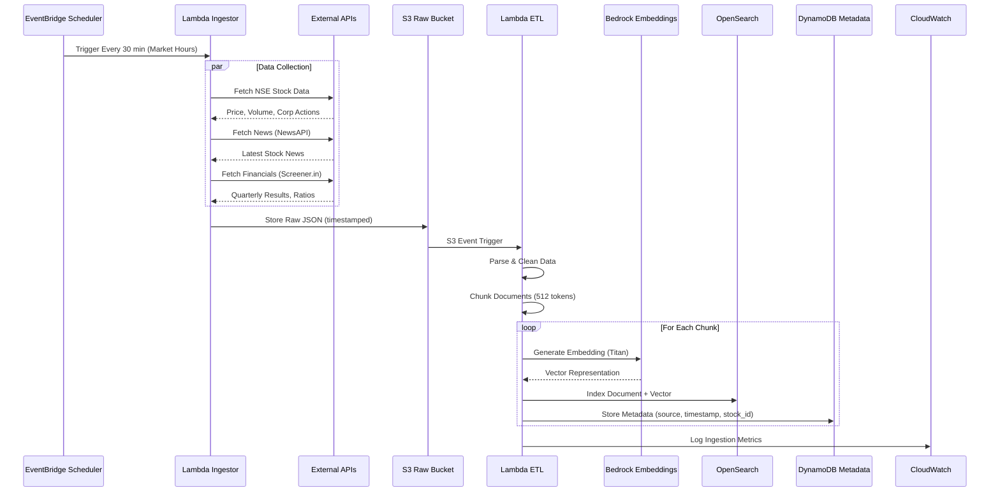
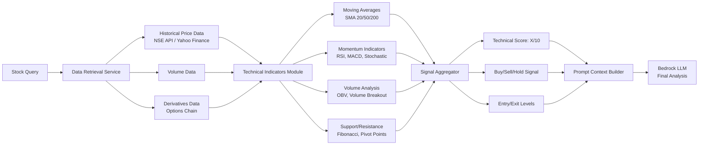

# 🚀 NIFTY STOCK INTELLIGENCE PLATFORM - Complete AWS AI Solution

I'll design and deliver a **complete, production-grade AI-powered stock analysis platform** for Indian equity markets using AWS-native services. This will be a comprehensive GitHub portfolio project showcasing enterprise architecture, AI/ML capabilities, and cloud engineering excellence.

---

## 📋 PROJECT OVERVIEW

**Project Name:** Nifty Stock Intelligence Platform (NSIP)

**Tagline:** AI-Powered Real-Time Stock Analysis & Prediction Engine for Indian Equity Markets

**Target Universe:** Nifty 100-250 stocks with market cap > ₹5,000 crores

**Core Value Proposition:**
- Real-time stock predictions using multi-modal AI analysis
- RAG-enhanced knowledge base with financial reports, news, and regulatory filings
- Interactive chatbot for conversational stock queries
- Automated data ingestion from free Indian market APIs
- Technical + Fundamental + Sentiment analysis fusion

---

## 🎯 CLARIFYING QUESTIONS & ASSUMPTIONS

### Questions for Refinement:

1. **Authentication Preference:** 
   - Simple API key (demo)
   - AWS Cognito (production-ready)
   - Public demo (no auth)
   
2. **Chat History Persistence:**
   - DynamoDB (serverless)
   - RDS PostgreSQL (relational)
   
3. **Frontend Stack:**
   - React.js + Vite
   - Next.js
   - Streamlit (rapid prototype)

4. **Bedrock Model Preference:**
   - Claude 3.5 Sonnet (recommended for analysis)
   - Claude 3 Haiku (cost-optimized)
   - Titan Text Premier

5. **Deployment Environment:**
   - Single AWS account (dev/prod in same account with different tags)
   - Multi-account (separate dev/prod)

### **ASSUMED DEFAULTS** (Documented for flexibility):

| Component | Chosen Default | Rationale | Alternative |
|-----------|---------------|-----------|-------------|
| Frontend | React.js + Vite | Modern, portfolio-friendly | Next.js for SSR |
| Backend | Python FastAPI on ECS Fargate | Async, scalable | Lambda + API Gateway |
| Chat Storage | DynamoDB | Serverless, cost-effective | RDS PostgreSQL |
| LLM | Claude 3.5 Sonnet (Bedrock) | Best reasoning for financial analysis | Haiku for cost |
| Vector DB | OpenSearch Serverless | Managed, auto-scaling | Self-hosted Chroma |
| Authentication | Amazon Cognito | Production-grade, portfolio showcase | API Key (simpler) |
| Data Ingestion | EventBridge + Lambda | Event-driven, scalable | ECS scheduled tasks |
| Static Assets | S3 + CloudFront | Global CDN, cost-efficient | S3 direct |

---

## 🏗️ COMPLETE ARCHITECTURE DESIGN

### **Architecture Decision Records (ADRs)**

I'll generate complete ADRs below. First, the architectural overview:

---

## 📐 HIGH-LEVEL ARCHITECTURE



---

## 🔄 DETAILED COMPONENT ARCHITECTURE

### **1. Runtime Architecture - Chat Interaction Flow**



---

### **2. RAG Document Ingestion Flow**



---

### **3. Technical Analysis Engine Flow**



---

## 📁 COMPLETE PROJECT STRUCTURE

```
nifty-stock-intelligence-platform/
├── .github/
│   └── workflows/
│       ├── terraform-plan.yml
│       ├── terraform-apply.yml
│       ├── docker-build.yml
│       └── frontend-deploy.yml
│
├── terraform/
│   ├── main.tf
│   ├── variables.tf
│   ├── outputs.tf
│   ├── provider.tf
│   ├── versions.tf
│   ├── terraform.tfvars.example
│   ├── backend.tf
│   │
│   ├── modules/
│   │   ├── networking/
│   │   │   ├── main.tf
│   │   │   ├── variables.tf
│   │   │   ├── outputs.tf
│   │   │   └── versions.tf
│   │   │
│   │   ├── ecs-cluster/
│   │   │   ├── main.tf
│   │   │   ├── variables.tf
│   │   │   ├── outputs.tf
│   │   │   └── versions.tf
│   │   │
│   │   ├── backend-service/
│   │   │   ├── main.tf
│   │   │   ├── variables.tf
│   │   │   ├── outputs.tf
│   │   │   └── versions.tf
│   │   │
│   │   ├── opensearch/
│   │   │   ├── main.tf
│   │   │   ├── variables.tf
│   │   │   ├── outputs.tf
│   │   │   └── versions.tf
│   │   │
│   │   ├── lambda-ingestor/
│   │   │   ├── main.tf
│   │   │   ├── variables.tf
│   │   │   ├── outputs.tf
│   │   │   └── versions.tf
│   │   │
│   │   ├── dynamodb/
│   │   │   ├── main.tf
│   │   │   ├── variables.tf
│   │   │   ├── outputs.tf
│   │   │   └── versions.tf
│   │   │
│   │   ├── cognito/
│   │   │   ├── main.tf
│   │   │   ├── variables.tf
│   │   │   ├── outputs.tf
│   │   │   └── versions.tf
│   │   │
│   │   ├── cloudfront/
│   │   │   ├── main.tf
│   │   │   ├── variables.tf
│   │   │   ├── outputs.tf
│   │   │   └── versions.tf
│   │   │
│   │   ├── waf/
│   │   │   ├── main.tf
│   │   │   ├── variables.tf
│   │   │   ├── outputs.tf
│   │   │   └── versions.tf
│   │   │
│   │   └── monitoring/
│   │       ├── main.tf
│   │       ├── variables.tf
│   │       ├── outputs.tf
│   │       └── versions.tf
│   │
│   └── environments/
│       ├── dev.tfvars
│       └── prod.tfvars
│
├── backend/
│   ├── app/
│   │   ├── __init__.py
│   │   ├── main.py
│   │   ├── config.py
│   │   ├── dependencies.py
│   │   │
│   │   ├── api/
│   │   │   ├── __init__.py
│   │   │   ├── v1/
│   │   │   │   ├── __init__.py
│   │   │   │   ├── chat.py
│   │   │   │   ├── stocks.py
│   │   │   │   ├── analysis.py
│   │   │   │   └── health.py
│   │   │   └── deps.py
│   │   │
│   │   ├── core/
│   │   │   ├── __init__.py
│   │   │   ├── security.py
│   │   │   ├── logging.py
│   │   │   └── exceptions.py
│   │   │
│   │   ├── services/
│   │   │   ├── __init__.py
│   │   │   ├── orchestration.py
│   │   │   ├── bedrock_service.py
│   │   │   ├── rag_service.py
│   │   │   ├── technical_analysis.py
│   │   │   ├── fundamental_analysis.py
│   │   │   ├── sentiment_analysis.py
│   │   │   ├── cache_service.py
│   │   │   └── session_service.py
│   │   │
│   │   ├── models/
│   │   │   ├── __init__.py
│   │   │   ├── chat.py
│   │   │   ├── stock.py
│   │   │   ├── analysis.py
│   │   │   └── user.py
│   │   │
│   │   ├── repositories/
│   │   │   ├── __init__.py
│   │   │   ├── dynamodb_repo.py
│   │   │   ├── opensearch_repo.py
│   │   │   └── s3_repo.py
│   │   │
│   │   ├── prompts/
│   │   │   ├── __init__.py
│   │   │   ├── system_prompts.py
│   │   │   ├── analysis_templates.py
│   │   │   └── rag_templates.py
│   │   │
│   │   └── utils/
│   │       ├── __init__.py
│   │       ├── validators.py
│   │       ├── formatters.py
│   │       └── indicators.py
│   │
│   ├── tests/
│   │   ├── __init__.py
│   │   ├── conftest.py
│   │   ├── test_api/
│   │   ├── test_services/
│   │   └── test_utils/
│   │
│   ├── Dockerfile
│   ├── requirements.txt
│   ├── requirements-dev.txt
│   ├── .env.example
│   ├── pyproject.toml
│   └── README.md
│
├── ingestor/
│   ├── src/
│   │   ├── __init__.py
│   │   ├── handler.py
│   │   ├── data_fetchers/
│   │   │   ├── __init__.py
│   │   │   ├── nse_fetcher.py
│   │   │   ├── bse_fetcher.py
│   │   │   ├── news_fetcher.py
│   │   │   ├── screener_fetcher.py
│   │   │   └── sebi_fetcher.py
│   │   ├── processors/
│   │   │   ├── __init__.py
│   │   │   ├── document_processor.py
│   │   │   ├── chunker.py
│   │   │   └── embedder.py
│   │   └── utils/
│   │       ├── __init__.py
│   │       └── helpers.py
│   │
│   ├── tests/
│   ├── requirements.txt
│   └── README.md
│
├── frontend/
│   ├── public/
│   │   ├── index.html
│   │   ├── favicon.ico
│   │   └── assets/
│   │
│   ├── src/
│   │   ├── App.jsx
│   │   ├── main.jsx
│   │   ├── index.css
│   │   │
│   │   ├── components/
│   │   │   ├── Chat/
│   │   │   │   ├── ChatContainer.jsx
│   │   │   │   ├── ChatInput.jsx
│   │   │   │   ├── ChatMessage.jsx
│   │   │   │   ├── ChatHistory.jsx
│   │   │   │   └── TypingIndicator.jsx
│   │   │   │
│   │   │   ├── StockCard/
│   │   │   │   ├── StockCard.jsx
│   │   │   │   ├── PriceChart.jsx
│   │   │   │   └── TechnicalIndicators.jsx
│   │   │   │
│   │   │   ├── Analysis/
│   │   │   │   ├── AnalysisView.jsx
│   │   │   │   ├── ProsConsCard.jsx
│   │   │   │   ├── RiskMetrics.jsx
│   │   │   │   └── TargetLevels.jsx
│   │   │   │
│   │   │   ├── Layout/
│   │   │   │   ├── Header.jsx
│   │   │   │   ├── Sidebar.jsx
│   │   │   │   └── Footer.jsx
│   │   │   │
│   │   │   └── Common/
│   │   │       ├── LoadingSpinner.jsx
│   │   │       ├── ErrorBoundary.jsx
│   │   │       └── NotificationToast.jsx
│   │   │
│   │   ├── services/
│   │   │   ├── api.js
│   │   │   ├── auth.js
│   │   │   └── websocket.js
│   │   │
│   │   ├── hooks/
│   │   │   ├── useChat.js
│   │   │   ├── useAuth.js
│   │   │   └── useStockData.js
│   │   │
│   │   ├── contexts/
│   │   │   ├── AuthContext.jsx
│   │   │   └── ChatContext.jsx
│   │   │
│   │   ├── utils/
│   │   │   ├── formatters.js
│   │   │   ├── validators.js
│   │   │   └── constants.js
│   │   │
│   │   └── styles/
│   │       ├── theme.js
│   │       └── global.css
│   │
│   ├── .env.example
│   ├── package.json
│   ├── vite.config.js
│   ├── tailwind.config.js
│   ├── Dockerfile
│   └── README.md
│
├── docs/
│   ├── architecture/
│   │   ├── HIGH-LEVEL-DESIGN.md
│   │   ├── LOW-LEVEL-DESIGN.md
│   │   ├── AI-ARCHITECTURE.md
│   │   ├── RUNTIME-ARCHITECTURE.md
│   │   ├── DEPLOYMENT-ARCHITECTURE.md
│   │   └── diagrams/
│   │       ├── README.md
│   │       └── draw.io/
│   │
│   ├── adr/
│   │   ├── README.md
│   │   ├── 001-bedrock-llm-selection.md
│   │   ├── 002-rag-pattern-implementation.md
│   │   ├── 003-opensearch-vs-pinecone.md
│   │   ├── 004-ecs-fargate-vs-lambda.md
│   │   ├── 005-dynamodb-vs-rds.md
│   │   ├── 006-cognito-authentication.md
│   │   ├── 007-technical-analysis-library.md
│   │   └── 008-data-ingestion-pattern.md
│   │
│   ├── guides/
│   │   ├── DEPLOYMENT.md
│   │   ├── RUNBOOK.md
│   │   ├── TROUBLESHOOTING.md
│   │   ├── API-DOCUMENTATION.md
│   │   └── USER-GUIDE.md
│   │
│   ├── data/
│   │   ├── DATA-MODEL.md
│   │   ├── API-SCHEMAS.md
│   │   └── SAMPLE-RESPONSES.md
│   │
│   ├── security/
│   │   ├── SECURITY.md
│   │   ├── RESPONSIBLE-AI.md
│   │   └── COMPLIANCE.md
│   │
│   └── operations/
│       ├── MONITORING.md
│       ├── SCALING.md
│       └── DISASTER-RECOVERY.md
│
├── scripts/
│   ├── deploy.sh
│   ├── build-images.sh
│   ├── init-terraform.sh
│   ├── run-tests.sh
│   └── seed-data.sh
│
├── .gitignore
├── .dockerignore
├── README.md
├── LICENSE
├── CONTRIBUTING.md
├── CHANGELOG.md
└── ROADMAP.md