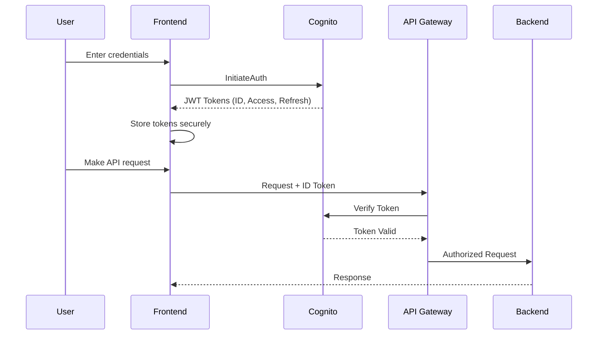

# ADR 006: Amazon Cognito for Authentication

**Status:** Accepted

**Date:** 2024-01-15

**Deciders:** Security Architect, Cloud Architect

---

## Context

We need user authentication and authorization for the stock intelligence platform. Requirements:
- User sign-up/sign-in
- Secure token management
- Optional MFA
- Session management
- OAuth/Social login (future)
- Integration with API Gateway/ALB
- GDPR compliance considerations

---

## Decision

We will use **Amazon Cognito User Pools** for authentication and authorization.

---

## Rationale

### Why Cognito:

#### ✅ Pros:

1. **AWS-Native Integration**
   - Direct integration with API Gateway
   - ALB authentication support
   - IAM role assumption
   - No additional libraries needed

2. **Security Features**
   - Built-in password policies
   - MFA support (SMS/TOTP)
   - Account recovery
   - Advanced security features (adaptive auth)

3. **Managed Service**
   - No auth server to maintain
   - Automatic scaling
   - High availability
   - Security patches handled

4. **Cost-Effective**
   - Free tier: 50,000 MAUs
   - Pay only for active users
   - No infrastructure costs

5. **Compliance**
   - GDPR compliant
   - HIPAA eligible
   - SOC 2 certified

6. **Developer Experience**
   - SDKs for all platforms
   - Hosted UI available
   - Customizable flows

#### ❌ Cons:
- AWS vendor lock-in
- Limited customization vs self-hosted
- Region-specific (no global user pool)

### Alternatives Considered:

#### 1. **Auth0**
- **Rejected:** Additional cost, data leaves AWS, vendor lock-in
- **Cost:** $23+/month vs Cognito free tier

#### 2. **Self-Hosted Keycloak**
- **Rejected:** Operational overhead, infrastructure costs
- **Complexity:** High maintenance burden

#### 3. **Firebase Auth**
- **Rejected:** Google ecosystem, multi-cloud complexity
- **Integration:** Poor AWS integration

#### 4. **Custom JWT Implementation**
- **Rejected:** Security risks, reinventing the wheel
- **Effort:** High development and maintenance cost

---

## Implementation Details

### User Pool Configuration:

```hcl
resource "aws_cognito_user_pool" "main" {
  name = "nifty-stock-intel-users"

  username_attributes      = ["email"]
  auto_verified_attributes = ["email"]

  password_policy {
    minimum_length                   = 12
    require_lowercase                = true
    require_numbers                  = true
    require_symbols                  = true
    require_uppercase                = true
    temporary_password_validity_days = 7
  }

  mfa_configuration = "OPTIONAL"

  software_token_mfa_configuration {
    enabled = true
  }

  account_recovery_setting {
    recovery_mechanism {
      name     = "verified_email"
      priority = 1
    }
  }

  schema {
    name                = "email"
    attribute_data_type = "String"
    required            = true
    mutable             = true
  }
}
```

### Authentication Flow:



---

## Security Configuration

### Token Validity:
```hcl
token_validity_units {
  access_token  = "hours"
  id_token      = "hours"
  refresh_token = "days"
}

access_token_validity  = 1   # 1 hour
id_token_validity      = 1   # 1 hour
refresh_token_validity = 30  # 30 days
```

### Advanced Security Features:
- Compromised credentials check
- Adaptive authentication
- User risk assessment
- Anomaly detection

---

## Cost Analysis

**Assumptions:** 1,000 monthly active users (MAUs)

| Service | Free Tier | Cost (1K MAUs) | Cost (10K MAUs) |
|---------|-----------|----------------|-----------------|
| Cognito | 50K MAUs | Free | Free |
| Auth0 | 7K MAUs | $23/month | $240/month |
| Keycloak (self-hosted) | N/A | ~$30/month (infra) | ~$100/month |

**Winner:** Cognito (free for portfolio project)

---

## User Flows

### Sign-Up Flow:
1. User submits email + password
2. Cognito validates password policy
3. Sends verification email
4. User clicks verification link
5. Account activated

### Sign-In Flow:
1. User submits credentials
2. Cognito validates
3. Returns JWT tokens
4. Frontend stores securely (httpOnly cookies or secure storage)

### Password Reset Flow:
1. User requests reset
2. Cognito sends reset code to email
3. User submits code + new password
4. Password updated

---

## Integration Points

### Frontend Integration:
```javascript
import { CognitoUserPool, CognitoUser } from 'amazon-cognito-identity-js'

const userPool = new CognitoUserPool({
  UserPoolId: process.env.VITE_COGNITO_USER_POOL_ID,
  ClientId: process.env.VITE_COGNITO_CLIENT_ID
})

// Sign in
const authenticationDetails = new AuthenticationDetails({
  Username: email,
  Password: password
})

const cognitoUser = new CognitoUser({
  Username: email,
  Pool: userPool
})

cognitoUser.authenticateUser(authenticationDetails, {
  onSuccess: (result) => {
    const accessToken = result.getAccessToken().getJwtToken()
    const idToken = result.getIdToken().getJwtToken()
    // Store tokens
  },
  onFailure: (err) => {
    console.error(err)
  }
})
```

### Backend Verification:
```python
import boto3
import jwt
from jose import jwk, jwt
from jose.utils import base64url_decode

def verify_token(token: str) -> dict:
    # Get Cognito public keys
    keys_url = f'https://cognito-idp.{region}.amazonaws.com/{user_pool_id}/.well-known/jwks.json'
    
    # Verify signature
    # Verify expiration
    # Verify audience
    
    return jwt.decode(token, key, algorithms=['RS256'])
```

---

## Consequences

### Positive:
- ✅ Zero infrastructure management
- ✅ Enterprise-grade security
- ✅ Free for portfolio project
- ✅ AWS ecosystem integration
- ✅ MFA support out of box
- ✅ Compliance certifications

### Negative:
- ❌ AWS vendor lock-in
- ❌ Limited UI customization
- ❌ Cannot migrate users easily
- ❌ Region-locked user pools

### Mitigation:
- Document migration strategy for user export
- Use Cognito SDK abstractions
- Plan for federated identity if going multi-cloud

---

## Future Enhancements

- [ ] Social login (Google, LinkedIn)
- [ ] SAML federation for enterprise
- [ ] Custom authentication challenges
- [ ] Risk-based authentication
- [ ] User analytics and insights

---

## References

- [Cognito User Pools Documentation](https://docs.aws.amazon.com/cognito/latest/developerguide/cognito-user-identity-pools.html)
- [Cognito Security Best Practices](https://docs.aws.amazon.com/cognito/latest/developerguide/managing-security.html)

---

## Related ADRs

- [ADR-004: ECS Fargate vs Lambda](004-ecs-fargate-vs-lambda.md)
