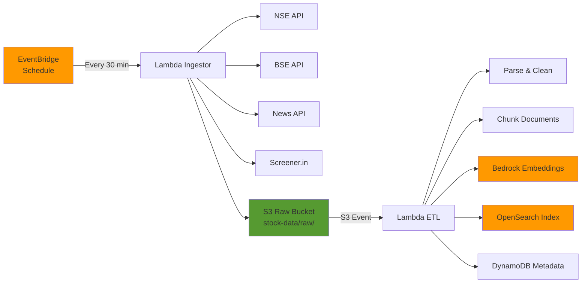

# ADR 008: Event-Driven Data Ingestion Pattern

**Status:** Accepted

**Date:** 2024-01-15

**Deciders:** Cloud Architect, Data Engineer

---

## Context

We need to ingest stock market data from multiple sources and make it available for RAG. Requirements:
- Fetch data from NSE, BSE, News APIs, Screener.in
- Process and store in S3 data lake
- Extract text, chunk documents, generate embeddings
- Index into OpenSearch
- Schedule during market hours
- Handle failures gracefully
- Cost-effective

---

## Decision

We will use an **event-driven architecture** with:
1. **EventBridge Scheduler** → Lambda (Data Fetching)
2. **S3 Event Notification** → Lambda (ETL Processing)
3. **Lambda** → Bedrock → OpenSearch (Indexing)

---

## Architecture Pattern



---

## Rationale

### Why Event-Driven Pattern:

#### ✅ Pros:

1. **Loose Coupling**
   - Ingestor doesn't know about ETL
   - S3 acts as buffer
   - Easy to add new processors

2. **Scalability**
   - Lambdas scale independently
   - No coordination needed
   - Parallel processing

3. **Reliability**
   - S3 durability (11 9's)
   - Automatic retries
   - Dead letter queues

4. **Cost-Effective**
   - Pay per execution
   - No idle resources
   - Lambdas auto-scale

5. **Simplicity**
   - Native AWS services
   - No orchestration engine
   - Clear separation of concerns

#### ❌ Cons:
- Slight delay (event propagation)
- Debugging complexity (distributed)
- Cold start latency

### Alternatives Considered:

#### 1. **Synchronous Pipeline (API → Process → Index)**
- **Rejected:** Long-running, timeout risk, no buffering

#### 2. **Step Functions Orchestration**
- **Rejected:** Overkill for simple pipeline, additional cost

#### 3. **SQS Queue-Based**
- **Rejected:** Adds complexity, S3 events sufficient

#### 4. **Kinesis Streams**
- **Rejected:** Over-engineering, higher cost

---

## Implementation Details

### Component 1: EventBridge Scheduler

```hcl
resource "aws_cloudwatch_event_rule" "ingestor_schedule" {
  name                = "stock-data-ingestion"
  description         = "Trigger stock data ingestion every 30 minutes"
  schedule_expression = "rate(30 minutes)"
  
  # Only during market hours (9:15 AM - 3:30 PM IST)
  # Implemented via Lambda logic or cron expression
}

resource "aws_cloudwatch_event_target" "ingestor" {
  rule      = aws_cloudwatch_event_rule.ingestor_schedule.name
  target_id = "IngestorLambda"
  arn       = aws_lambda_function.ingestor.arn
}
```

### Component 2: Lambda Ingestor

**Purpose:** Fetch data from external APIs and store in S3

**Trigger:** EventBridge Schedule  
**Runtime:** Python 3.11  
**Timeout:** 5 minutes  
**Memory:** 512 MB

**Flow:**
1. Receive trigger event
2. Fetch data from all sources
3. Store raw JSON in S3 with timestamp
4. Return summary

**Error Handling:**
- Retry failed API calls (exponential backoff)
- Log failures to CloudWatch
- Continue with available data

### Component 3: S3 Event Notification

```hcl
resource "aws_s3_bucket_notification" "data_lake" {
  bucket = aws_s3_bucket.data_lake.id

  lambda_function {
    lambda_function_arn = aws_lambda_function.etl.arn
    events              = ["s3:ObjectCreated:*"]
    filter_prefix       = "raw/stocks/"
    filter_suffix       = ".json"
  }
}
```

### Component 4: Lambda ETL Processor

**Purpose:** Process raw data, generate embeddings, index

**Trigger:** S3 Event  
**Runtime:** Python 3.11  
**Timeout:** 15 minutes  
**Memory:** 2048 MB  
**VPC:** Yes (for OpenSearch access)

**Flow:**
1. Receive S3 event notification
2. Download raw JSON
3. Parse and structure data
4. Chunk text content (512 tokens, 50 overlap)
5. Generate embeddings via Bedrock
6. Index to OpenSearch
7. Store metadata in DynamoDB

**Error Handling:**
- DLQ for failed events
- Idempotent operations (check if already indexed)
- Partial success tracking

---

## Data Flow Details

### S3 Bucket Structure:

```
s3://nsip-data-lake/
├── raw/
│   └── stocks/
│       └── {SYMBOL}/
│           └── {YYYY}/{MM}/{DD}/{HHmmss}.json
├── processed/
│   └── {SYMBOL}/
│       └── {date}/
│           └── chunks.json
└── embeddings/
    └── {SYMBOL}/
        └── {date}/
            └── vectors.json
```

### Document Chunking Strategy:

```python
def chunk_document(content: str, metadata: dict):
    chunks = []
    chunk_size = 512  # tokens
    overlap = 50      # tokens
    
    # Split by sentences first
    sentences = sent_tokenize(content)
    
    current_chunk = []
    current_length = 0
    
    for sentence in sentences:
        sent_tokens = len(tokenize(sentence))
        
        if current_length + sent_tokens > chunk_size:
            chunks.append({
                'content': ' '.join(current_chunk),
                'metadata': metadata,
                'chunk_index': len(chunks)
            })
            # Keep last N tokens for overlap
            current_chunk = current_chunk[-overlap:]
            current_length = sum(len(tokenize(s)) for s in current_chunk)
        
        current_chunk.append(sentence)
        current_length += sent_tokens
    
    return chunks
```

### Embedding Generation:

```python
import boto3

bedrock_runtime = boto3.client('bedrock-runtime')

def generate_embedding(text: str) -> list:
    response = bedrock_runtime.invoke_model(
        modelId='amazon.titan-embed-text-v2:0',
        body=json.dumps({'inputText': text})
    )
    
    result = json.loads(response['body'].read())
    return result['embedding']  # 1024 dimensions
```

---

## Schedule Optimization

### Market Hours Logic:

```python
from datetime import datetime
import pytz

def is_market_hours():
    ist = pytz.timezone('Asia/Kolkata')
    now = datetime.now(ist)
    
    # Market hours: Mon-Fri, 9:15 AM - 3:30 PM IST
    if now.weekday() >= 5:  # Saturday or Sunday
        return False
    
    market_open = now.replace(hour=9, minute=15, second=0)
    market_close = now.replace(hour=15, minute=30, second=0)
    
    return market_open <= now <= market_close

def lambda_handler(event, context):
    if not is_market_hours():
        return {
            'statusCode': 200,
            'message': 'Skipped - outside market hours'
        }
    
    # Proceed with ingestion
    ...
```

---

## Error Handling & Retry Strategy

### Lambda Ingestor:
```python
from tenacity import retry, stop_after_attempt, wait_exponential

@retry(
    stop=stop_after_attempt(3),
    wait=wait_exponential(multiplier=1, min=2, max=10)
)
def fetch_stock_data(symbol: str):
    response = requests.get(f"{NSE_API}/quote/{symbol}")
    response.raise_for_status()
    return response.json()
```

### Dead Letter Queue Configuration:
```hcl
resource "aws_sqs_queue" "etl_dlq" {
  name                      = "stock-etl-dlq"
  message_retention_seconds = 1209600  # 14 days
}

resource "aws_lambda_function" "etl" {
  # ... other config
  
  dead_letter_config {
    target_arn = aws_sqs_queue.etl_dlq.arn
  }
}
```

---

## Cost Analysis

**Assumptions:**
- 100 stocks tracked
- Ingestion every 30 min during market hours (6.5 hours/day)
- 20 trading days/month
- Average 3 KB per stock per fetch
- 10 chunks per stock document

| Component | Invocations/Month | Cost |
|-----------|-------------------|------|
| Lambda Ingestor (512 MB, 1 min) | 260 | $0.05 |
| Lambda ETL (2048 MB, 2 min) | 2,600 | $1.50 |
| Bedrock Embeddings (1M tokens) | - | $0.10 |
| S3 Storage (10 GB) | - | $0.23 |
| S3 Requests (PUT/GET) | 3,000 | $0.02 |
| OpenSearch Indexing | - | Included |
| DynamoDB Writes | 2,600 | $0.33 |
| **Total** | | **~$2.23/month** |

**Extremely cost-effective for portfolio project!**

---

## Monitoring & Observability

### CloudWatch Metrics:
- Lambda invocation count
- Lambda duration
- Lambda errors
- S3 object count
- OpenSearch indexing rate
- Bedrock invocation count

### CloudWatch Alarms:
```hcl
resource "aws_cloudwatch_metric_alarm" "etl_errors" {
  alarm_name          = "stock-etl-high-errors"
  comparison_operator = "GreaterThanThreshold"
  evaluation_periods  = 2
  metric_name         = "Errors"
  namespace           = "AWS/Lambda"
  period              = 300
  statistic           = "Sum"
  threshold           = 10
  
  dimensions = {
    FunctionName = aws_lambda_function.etl.function_name
  }
}
```

### Logs:
```python
import logging
import json

logger = logging.getLogger()
logger.setLevel(logging.INFO)

def lambda_handler(event, context):
    logger.info('Ingestion started', extra={
        'event': event,
        'stocks_count': len(stocks)
    })
    
    # ... processing
    
    logger.info('Ingestion completed', extra={
        'successful': success_count,
        'failed': fail